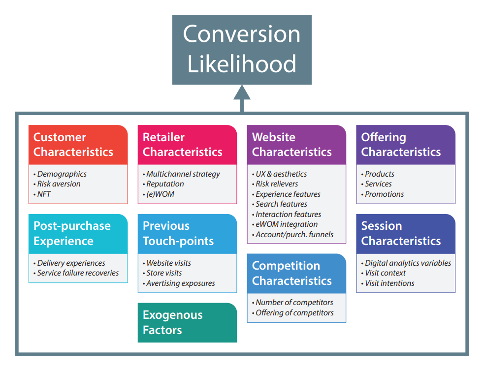

During my academic exchange at Maastricht University in 2016, I dedicated my thesis research to online conversion, and applied statistical techniques on a site-centric dataset from a French e-retailer. This work, titled "How can e-retailers reduce the gap between online and offline conversion rates?" was chosen to represent Maastricht University at the Dutch Marketing Thesis Award in 2016. You can read the abstract below or download the paper in full right [here!](./julienBovetMasterThesis.pdf)

>This paper introduces and investigates the gap between online and offline conversion rates. After reviewing a large body of literature on both physical retailing and e-retailing, the author designs a theoretical framework with nine factors that significantly influence conversion probabilities: customer characteristics, retailer characteristics, website characteristics, offering characteristics, session characteristics, competition, previous touch-points, post-purchase experience and exogenous factors. In order to validate this framework, qualitative and quantitative methods are applied. On one hand, the author conducted four focus groups and a few in-depth interviews to gather critical feedback from consumers and digital professionals. On the other hand, the author applied three statistical techniques (logistic, OLS and symbolic regressions) to a click-stream data set provided by a major click-and-mortar retailer in France. In addition to the theoretical framework and the statistical results, the author also outlines four major opportunities for e-retailers, and many ideas for further research. This effort should mainly be considered as a ground work for follow-up studies that the author wishes to pursue.
