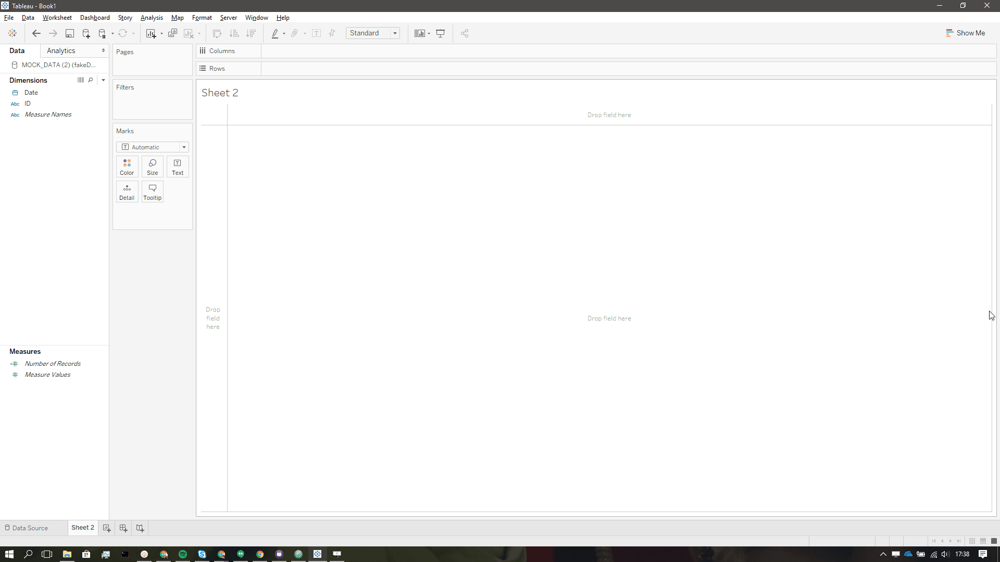
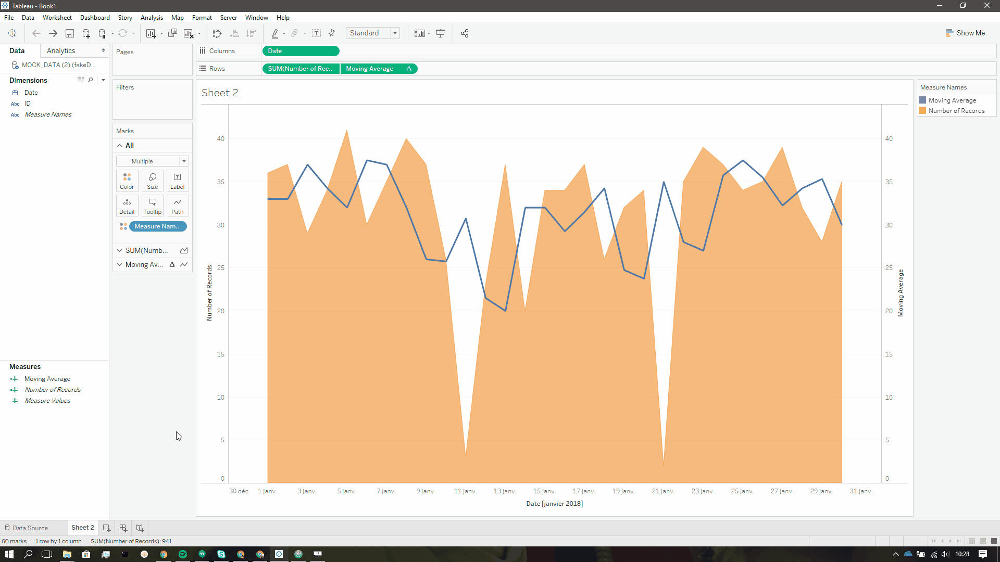
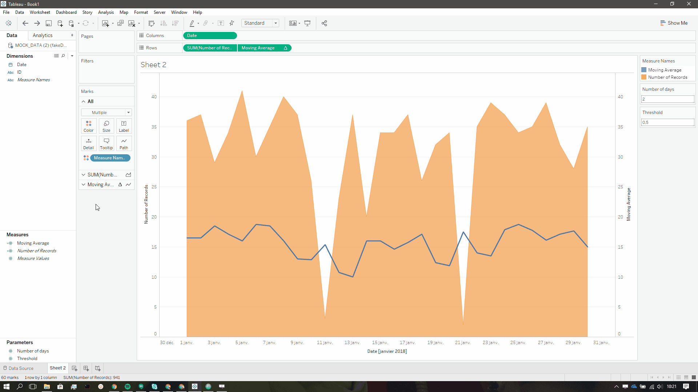
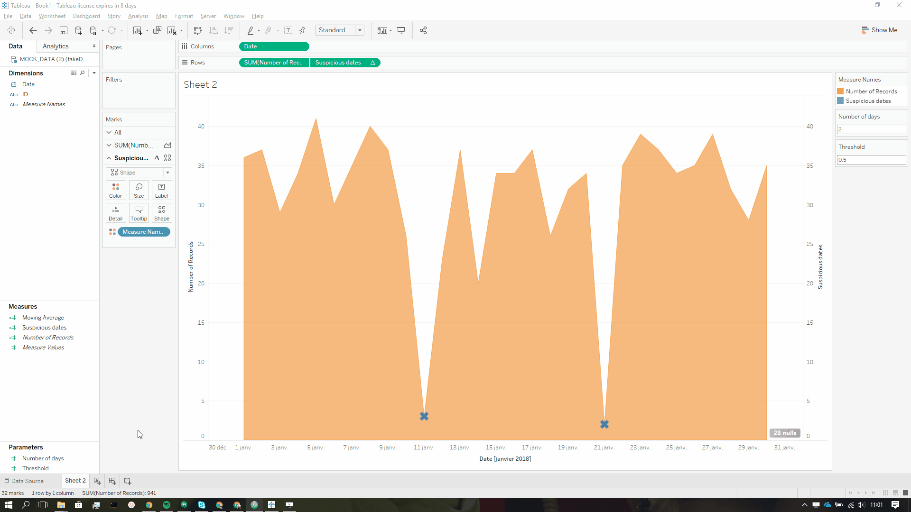
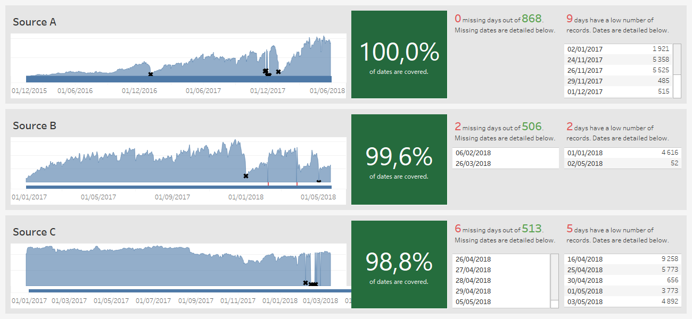

>[This article is part of a series on monitoring data quality with Tableau. If you haven't checked part one, click here!](/monitoring-data-quality-with-tableau-1)

In the previous blog post, we saw how to identify missing dates in a source. Let's talk about a *worst* kind of dates, those who are in the dataset, but with an extremely low number of records.


Chances are these dates were inserted with a faulty batch run and you only have a percentage of what you should. How can we automatically detect them? Simply put, we need to check the number of records for each date, and decide whether it seems high enough, or too low. One could use a simple constant to determine incomplete dates:

> Days with less than ten records are suspicious!

However, this approach will fail to capture suspicious dates in large datasets, and datasets subject to seasonal effects. Instead, why don't we take a look at moving averages?

## Moving averages

If you're interested in the maths behind moving averages, [Wikipedia](https://en.wikipedia.org/wiki/Moving_average) is your friend. In Tableau, moving averages can be computed using table calculations quite easily. For this tutorial, I built a [fake dataset](./fakeData.xlsx), but I encourage you, again, to directly use your own data.

1. Bring the `Date` field in the columns shelf.
2. Bring `Number of Records` in the rows shelf.
3. Turn your `Date` pill to "Exact Date".
4. Bring the `Number of Records` in the rows shelf once more.
5. Right-click on your second `Number of Records` pill, and click on "Quick Table Calculation > Moving Average".
6. Right-click again, and select "Edit Table Calculation".
7. Choose 2 days before and 2 days after.
8. **Uncheck "Current value"**.
9. Ctrl + click on your new and shiny moving average, drop it in the data panel and name it `Moving Average`. Life is not always full of surprises.
10. Replace the second pill in the rows shelf with `Moving Average`.
11. Right-click on the pill you just placed, and select "Dual Axis"
12. Right-click on the right axis in your viz, and select "Synchronize Axis"
13. Turn the `SUM(Number of Records)` mark type to "Area"

[](./firstpart.gif)

## Parameters!

To fine tune the number of days we want in the moving average, and the threshold against which dates are considered incomplete, let's use parameters.

1. Create a parameter called `Number of days` with an integer data type, and a minimum value of 1.
2. Create a parameter called `Threshold` with a float data type, and a range between 0 and 1.
3. Edit your `Moving Average` variable in the data panel, replace the previous value we chose with your `Number of days` parameter, and multiply everything with our `Threshold` parameter. If you're lazy, copy-paste the formula below:

```sql
[Threshold]*((ZN(WINDOW_SUM(SUM([Number of Records]), -[Number of days], -1)) +
  ZN(WINDOW_SUM(SUM([Number of Records]), 1, [Number of days]))) /
(ZN(WINDOW_COUNT(SUM([Number of Records]), -[Number of days], -1)) +
  ZN(WINDOW_COUNT(SUM([Number of Records]), 1, [Number of days]))))
```

4. Here's the fun part: play a little bit with your parameters until you're satisfied with the result. Two days and a threshold of 0.5 should be a good place to start. Being too strict will give you false positives, while being too permissive will give you false negatives. I'm sorry for the headache, but you get the idea ;).

[](./secondpart.gif)

## Bring suspicious dates to light

Now that we defined our reference with the moving average, let's put a tick on suspicious dates.

1. Right-click on `Moving Average` in the data panel and select "Create > Calculated Field...", name it `Suspicious Dates`
2. Test your number of records against `Moving Average`:

```sql
IF SUM([Number of Records]) < [Moving Average] THEN SUM([Number of Records]) ELSE NULL END
```

3. Replace the `Moving Average` pill on the rows shelf with your new calculation.
4. Change the mark type for your `Suspicious Dates` to "Shape".
5. Enjoy.

[](./thirdpart.gif)

### Again, can't we just list the dates?

Alright, this time I'll help you a bit. Remember, it's always better to duplicate a sheet and use it as a starting point.

1. Duplicate the sheet.
2. Get the `SUM(Number of Records)` pill out of the rows shelf.
3. Turn the `Date` pill in the columns shelf to discrete.
4. Move it to the rows shelf.
5. Move the `Suspicious Dates` pill in the rows shelf to the Marks panel and drop it on 'Text'.
6. Turn the mark type to 'Text'.
7. Make sure `Suspicious Dates` is still computed using `Date`.
8. Ctrl + click on `Suspicious Dates` and drop it on the filters shelf.
9. Edit the filter, and in special, select 'Non-null values'
10. Et voilà!

[](./fourthpart.gif)

I often find myself struggling with these simple lists. The key is to remember that:
- `Suspicious Dates` is a table calculation that needs every date to work properly.
- Using table calculations as filters do not filter out the underlying data, but only hides marks in the view.
- Tableau often resets the 'Compute Using' setting for table calculations.

To wrap up this post and the previous one, here's what you could end up with using the techniques we learned:


