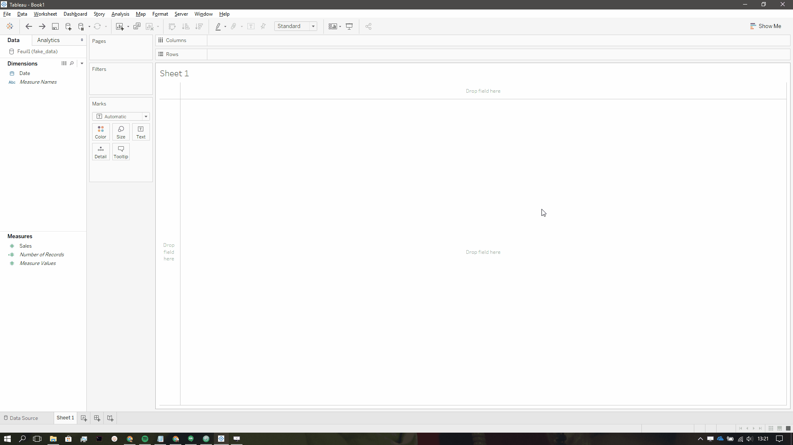
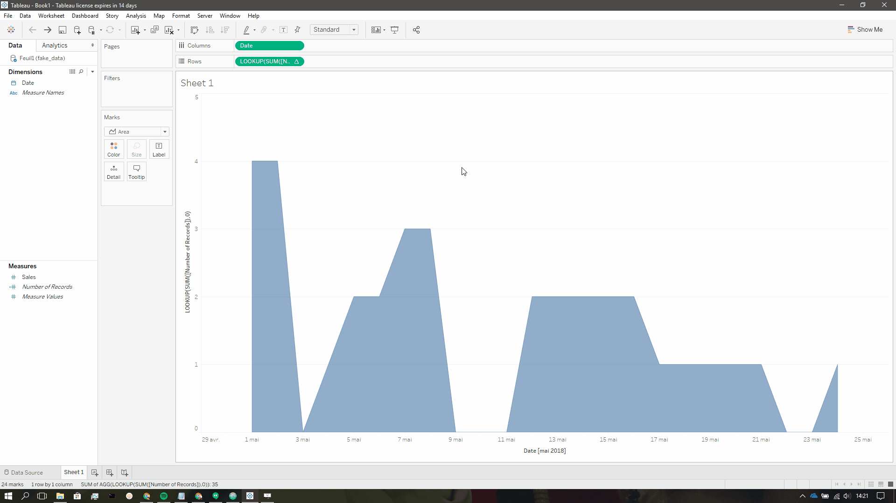
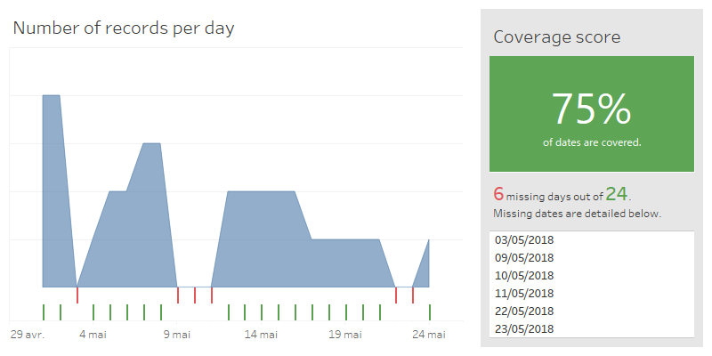

In a perfect world, companies use dedicated tools and hire people responsible for data quality.


But let's be real: I'm fairly certain we're all facing data quality issues with our sources. You'll find in this series of blog posts a few inputs on how you can monitor data quality directly in Tableau. The objective is not to patch or correct your data with Tableau tricks, since it will only make things worse in the long run, but to design a monitoring dashboard that will tell you at a glance what is missing or what needs to be fixed.

## But what is Data Quality?

After some googling, it appears that a handful of dimensions are used to define data quality, such as completeness, uniqueness, timeliness, consistency, conformity, integrity, and so on. Instead of copy-pasting definitions here, let's deep dive into concrete stuff immediately. If you truly want to read more about the concept of data quality and its dimensions, [just let me google that for you!](http://www.letmegooglethat.com/?q=data+quality+dimensions)

## Problems?

Here's the deal: data sources are often updated using batch processing, which means that each morning, yesterday's data is inserted. When this process is not perfectly orchestrated or monitored using wonderful tools such as [Airflow](https://airflow.apache.org/), you might end up with missing dates for various reasons. Moreover, when you deal with huge databases over multiple years, one or two missing days can easily go unnoticed.

[comment]: # (Stop it GIF)

## Solutions!

Let's start this series by making a simple dashboard that shows how many records you have per day and puts into light those missing fuckers. For this tutorial, you can use my [fake dataset](./fake_data.xlsx), but I'd advise you to directly work with your own data.

### Records per day

First things first, let's create a simple area chart showing how many records we have per day.

1. Drag your `Date` dimension into the columns shelf.
2. Drag `Number of Records` into the rows shelf.
3. Right click on the `Date` pill and select "Exact Date".

Ok, so at this point, you should already see how many records you have each day. However, Tableau does not create marks for missing dates, which is fairly normal since they do not exist in the dataset. We're going to add a little magic to get what we want.

4. In the Rows shelf, change the calculation to:

```
LOOKUP(SUM([Number of Records]),0)
```

5. Right click on the `Date` pill, and check "Show Missing Values"
6. Right click on the Rows pill again and select "Format...".
7. In the "Special Values (e.g. NULL)", choose to display Marks at Default Value.

Now, with the `LOOKUP` table calculation, Tableau is no longer checking what is in the data source, but what is displayed in the viz instead. Combine this with "Show Missing Values", and Tableau will test the table calculation for each date, including the missing ones. However, Tableau still doesn't know what to do when there's absolutely no record for a date, and "Show at Default Value" is our final trick.

8. Turn the marks type from automatic to "Area".
9. Enjoy.



### Binary indicator

The previous chart is a nice start: you can clearly see how the number of records changes on a day to day basis, and whether or not some days are at 0. However, when you're dealing with two years or more of data, and a huge number of records per day, finding those thin drops to zero will be extremely difficult. Let's make a simpler chart, showing whether dates have records or not.

1. Let's clean things a bit first, do a Ctrl + click on the calculation and drop it like it's hot in the data pane. Give a proper name to the calculation, such as `Number of Records (incl. 0)`.
2. Right click on this measure, and create a new calculated field called `Missing?` with the following formula:

```
IF [Number of Records (incl. 0)] > 0 THEN "Present" ELSE "Missing" END
```

3. Duplicate the sheet so that we don't have to start from scratch again.
4. Drop the calculation in the Rows shelf.
5. Turn the Marks type to Gantt Bar.
6. Apply our binary variable `Missing?` in the Rows shelf and on color.
7. Change the color scheme to make missing values look bad, and present values look good.
8. Get yourself a coffee.



### Can't we just list the dates?

You can, and you should! In fact, you could also add a few text elements, such as the overall coverage, or the exact number of missing days. There's nothing incredibly hard to get these sheets up and running: I won't do a step-by-step and leave you the fun to figure it out!

Here's a final dashboard though to see a potential end result:


